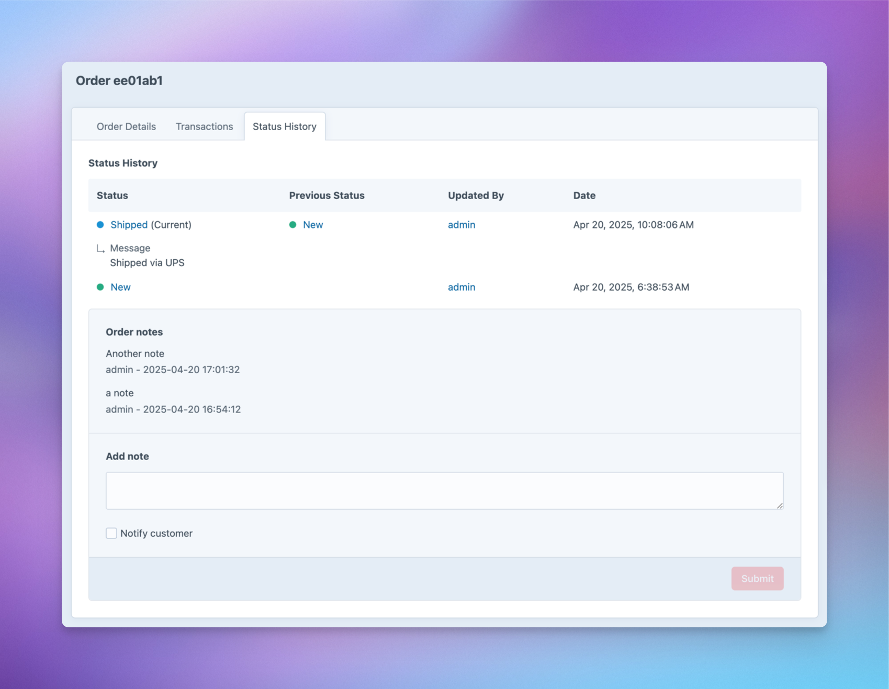

# Order Notes plugin for Craft CMS 3 and Craft Commerce 3.4.25

A simple plugin that adds notes to Craft Commerce orders. Team members can add notes directly to orders and optionally notify customers by email.



# Key Features

- Add, view, and track notes on any order
- See who added each note and when
- Optionally notify customers about notes via email
- Customize email templates and sender information
- Works with existing user permissions
- Maintains a history of all order-related notes


## Requirements

This plugin requires Craft CMS 3.0.0 or later.

## Installation

To install the plugin, follow these instructions.

1. Open your terminal and go to your Craft project:

        cd /path/to/project

2. Then tell Composer to load the plugin:

        composer require superbig/craft-ordernotes

3. In the Control Panel, go to Settings → Plugins and click the “Install” button for Order Notes.

## Order Notes Overview

The Order Notes plugin will add a section to the Commerce Order details view, where any users with access may add notes.

## Configuring Order Notes

Before using the plugin, you should update all the settings values.

Alternatively you can use the example config file to override the settings:

```php
<?php
return [
    // Sender Email Address
    'notifyEmailFrom'         => '',

    // Sender Name
    'notifyEmailFromName'     => '',

    // HTML email template - will receive order and note as variables
    'notifyEmailTemplate'     => '',

    // Text email template (defaults to HTML if not set) - will receive order and note as variables
    'notifyEmailTemplateText' => '',

    // Email subject - will receive order and note as variables
    'notifyEmailSubject'      => '',
];
```

## Order Notes Roadmap

* Add file attachments

Brought to you by [Superbig](https://superbig.co)
